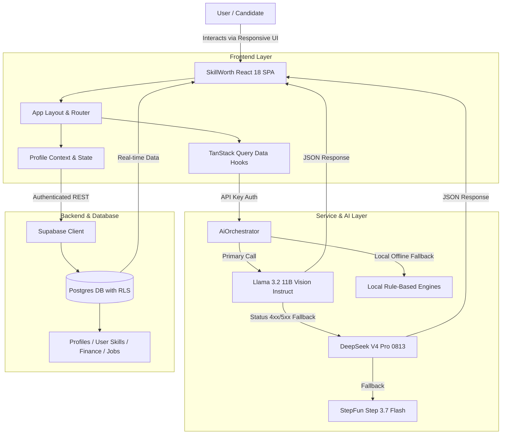
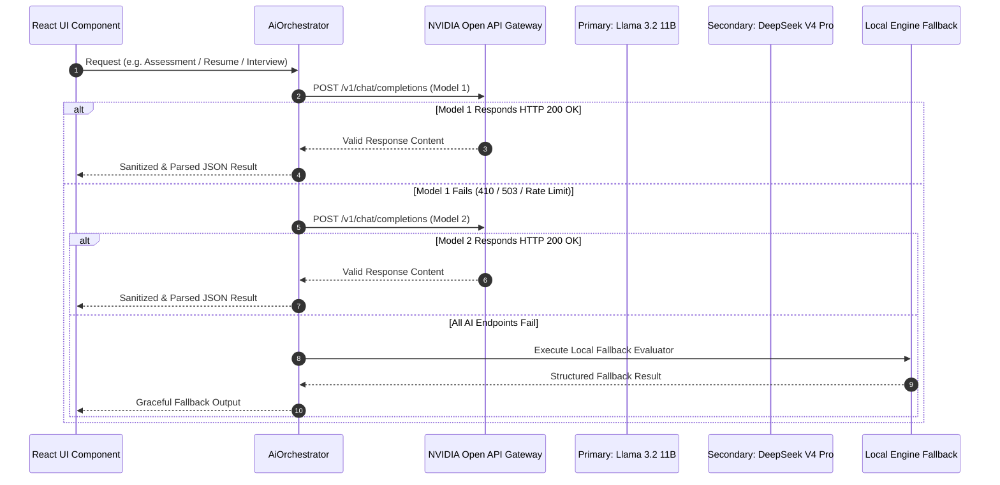

<div align="center">

# 🚀 SkillWorth

### **AI-Powered Career Intelligence, Technical Skill Verification & Financial Growth Engine**


<p align="center">
  <b>Empowering students, developers, and career Switchers to build verified skill portfolios, excel in AI mock interviews, optimize ATS resume alignment, and accelerate financial growth velocity.</b>
</p>

---

</div>

## 📑 Table of Contents

- [✨ Overview](#-overview)
- [🌟 Key Platform Modules](#-key-platform-modules)
- [📊 Feature Comparison & Capability Matrix](#-feature-comparison--capability-matrix)
- [🏗️ System & AI Architecture](#️-system--ai-architecture)
  - [High-Level Data & Service Flow](#high-level-data--service-flow)
  - [Multi-Model AI Orchestrator Fallback Engine](#multi-model-ai-orchestrator-fallback-engine)
- [🔥 Comprehensive Feature Breakdown](#-comprehensive-feature-breakdown)
  - [1. Student Skill Portfolio & Matrix](#1-student-skill-portfolio--matrix)
  - [2. AI Resume Intelligence & ATS Parser](#2-ai-resume-intelligence--ats-parser)
  - [3. Adaptive AI Skill Verification](#3-adaptive-ai-skill-verification)
  - [4. Real-Time AI Technical & HR Mock Interview Simulator](#4-real-time-ai-technical--hr-mock-interview-simulator)
  - [5. Career DNA Explorer & Industry Radar](#5-career-dna-explorer--industry-radar)
  - [6. Financial Growth & Burn-Rate Velocity Engine](#6-financial-growth--burn-rate-velocity-engine)
  - [7. Multi-Signal Job Readiness & Growth Planner](#7-multi-signal-job-readiness--growth-planner)
- [🗄️ Database Schema & Security (Supabase RLS)](#️-database-schema--security-supabase-rls)
- [🛠️ Tech Stack & Dependencies](#️-tech-stack--dependencies)
- [🚀 Quick Start & Installation](#-quick-start--installation)
- [🔑 Environment Variables Setup](#-environment-variables-setup)
- [🧪 Testing & Quality Assurance](#-testing--quality-assurance)
- [📁 Directory Structure](#-directory-structure)
- [💱 Currency & Localization (INR ₹)](#-currency--localization-inr-)
- [🤝 Contributing & Support](#-contributing--support)

---

## ✨ Overview

**SkillWorth** bridges the gap between technical skill acquisition, job market readiness, and financial self-sufficiency. Rather than treating learning, job hunting, and budget planning as isolated tasks, SkillWorth connects them into a unified **AI-driven career engine**.

### **Core Problem Solved**
* **Skill Ambiguity**: Students don't know whether their self-declared skills match real industry benchmarks.
* **Resume Blackboxes**: Job applicants get rejected by ATS software without clear actionable feedback.
* **Interview Anxiety**: Developers struggle in live technical interviews due to lack of realistic practice.
* **Financial Misalignment**: Early professionals don't see how acquiring specific skills translates into real salary increases and long-term savings runway.

### **SkillWorth Solution**
SkillWorth provides a real-time interactive platform featuring **AI-based skill testing**, **ATS resume extraction**, **interactive technical mock interviews**, **career match scoring**, and **financial runway projection** in INR (₹).

---

## 🌟 Key Platform Modules

| Module Icon | Module Name | Primary Objective | Key Output |
| :---: | :--- | :--- | :--- |
| 🛡️ | **Skills Portfolio & Matrix** | Track, verify, and visualize technical & soft skills | Interactive Heatmaps, Verified Skill Badges |
| 📄 | **AI Resume Analyzer** | Deep ATS formatting, keyword density & section audit | ATS Score (%), Missing Skills, Impact Suggestions |
| 🎯 | **Adaptive AI Verification** | Dynamic 3-tier technical skill assessment | Verification Certificate, Level Upgrade |
| 🎙️ | **Mock Interview Simulator** | AI-driven technical & HR conversational practice | Readiness Scores, Dynamic Follow-up Questions |
| 🧭 | **Career DNA Explorer** | Align interests & skills with high-demand job roles | Match Percentage, Salary Projection, Skill Tiers |
| 💰 | **Financial Velocity Engine** | Track income, expenses, burn rate, and savings runway | Emergency Runway (Months), Savings Ladder |
| 📈 | **Adaptive Growth Planner** | Multi-signal readiness score & step-by-step roadmap | Unified Readiness Index (0-100%), Career Gates |

---

## 📊 Feature Comparison & Capability Matrix

| Feature Feature | Traditional Portfolios | SkillWorth Engine | Business & Career Impact |
| :--- | :---: | :---: | :--- |
| **Skill Validation** | Self-reported text | 🧠 **AI-Generated 3-Tier Technical Testing** | Verifies true coding execution skills |
| **Resume Analysis** | Manual review | ⚡ **Instant ATS Keyword & Metric Parser** | Increases interview callback rates |
| **Mock Interviews** | Static question lists | 🤖 **Conversational AI Adaptive Follow-Ups** | Builds real-time architectural articulation |
| **Career Matching** | Generic job listings | 🎯 **Skill-Gap Weighted Alignment Algorithm** | Directs learning towards high-impact gaps |
| **Financial Runway** | Basic budget spreadsheets | 💸 **Burn-rate & Emergency Savings Velocity** | Ensures financial independence & runway |

---

## 🏗️ System & AI Architecture

SkillWorth utilizes a decoupled modern web architecture combining **React 18**, **TailwindCSS**, **Supabase (Auth + RLS Postgres)**, and a **Multi-Model AI Orchestrator** with automatic fallback.

### High-Level Data & Service Flow



### Multi-Model AI Orchestrator Fallback Engine



---

## 🔥 Comprehensive Feature Breakdown

### 1. Student Skill Portfolio & Matrix
* **Dual Skill Verification**: Differentiates between *Self-Declared* skills and *AI-Verified* skills.
* **Interactive Skill Heatmaps**: Visualizes proficiency levels (Beginner, Intermediate, Advanced, Expert) across tech domains.
* **Skill Radar**: Compares user skill distribution against target role benchmarks.

### 2. AI Resume Intelligence & ATS Parser
* **Instant Section Extraction**: Parses skills, education, work experience, portfolio projects, and certifications.
* **ATS Compatibility Audit**: Evaluates formatting readability, section completeness, and email/contact presence.
* **Metric & Impact Detection**: Scans for quantifiable numbers (percentages, latency reductions, user scale) and flags weak/generic phrases.

### 3. Adaptive AI Skill Verification
* **Dynamic Quiz Generation**: Generates 4 adaptive technical questions tailored to the specified skill and claimed proficiency.
* **3-Tier Concept Testing**: Evaluates syntax knowledge (Tier 1), practical execution (Tier 2), and architectural problem-solving (Tier 3).
* **Automatic Skill Level Upgrade**: Upgrades skill status to `VERIFIED` upon achieving a passing score.

### 4. Real-Time AI Technical & HR Mock Interview Simulator
* **Multi-Mode Support**: Conduct Technical, HR, Behavioral, Project-Based, and Resume-Based interviews.
* **Dynamic AI Follow-Up Questions**: Evaluates candidate text answers and generates context-aware follow-up probing technical design choices.
* **3-Turn Evaluation & Final Report**: Generates scores for Technical Accuracy, Communication, and Architectural Design with target learning recommendations.

### 5. Career DNA Explorer & Industry Radar
* **Algorithmic Career Alignment**: Calculates match percentages for major software roles (Frontend, Backend, Full-Stack, Data Engineer, DevOps, etc.).
* **Skill Tier Requirements**: Outlines exact Beginner, Intermediate, and Advanced skill requirements for each target role.
* **Curated Portfolio Projects & Certifications**: Provides concrete project ideas and industry-recognized certifications.

### 6. Financial Growth & Burn-Rate Velocity Engine
* **INR Currency Support (₹)**: All financial values formatted in Indian Rupees (`₹`).
* **Emergency Runway Calculator**: Computes emergency financial runway in months based on liquid savings and monthly burn rate.
* **Savings Velocity Ladder**: Tracks progress towards financial independence and milestone gates.
* **Debt Payoff Simulator**: Simulates debt reduction strategies.

### 7. Multi-Signal Job Readiness & Growth Planner
* **Multi-Signal Readiness Index (0-100%)**: Blends skill match ratio, verified skill count, resume ATS score, and mock interview performance into a single readiness score.
* **Milestone Roadmap**: Provides step-by-step guidance across technical skills, portfolio projects, certifications, and internship applications.

---

## 🗄️ Database Schema & Security (Supabase RLS)

SkillWorth uses PostgreSQL hosted on Supabase with **Row Level Security (RLS)** to enforce strict data isolation between users.

| Table Name | Purpose | RLS Policies | Key Columns |
| :--- | :--- | :--- | :--- |
| `profiles` | Stores student profile metadata, target career, and readiness score | Read/Write restricted to `auth.uid() == user_id` | `id`, `user_id`, `name`, `target_career`, `readiness_score` |
| `skills` | Master catalog of standardized technical & soft skills | Public Read access | `id`, `name`, `category`, `demand_score`, `base_salary_impact` |
| `user_skills` | Maps user skills, proficiency levels, and verification state | Read/Write restricted to `auth.uid() == user_id` | `id`, `user_id`, `skill_id`, `level`, `status` |
| `jobs` | Master catalog of career roles, salary ranges, and skill requirements | Public Read access | `id`, `title`, `min_salary`, `max_salary`, `required_skills` |
| `finance` | Stores income, expense logs, savings goals, and burn rate | Read/Write restricted to `auth.uid() == user_id` | `id`, `user_id`, `monthly_income`, `monthly_expense`, `savings_target` |

---

## 🛠️ Tech Stack & Dependencies

```
Frontend Core       : React 18, TypeScript, Vite 5
Styling & UI        : Tailwind CSS, Radix UI Primitives, Lucide Icons, Class Variance Authority
Data & State        : TanStack Query (React Query) v5, React Context API, React Router v6
Data Visualization  : Recharts
Backend & Auth      : Supabase JS Client (Postgres, RLS Auth)
AI Integration      : Multi-Model AI Orchestrator (Llama 3.2 11B, DeepSeek V4 Pro, StepFun)
Testing Suite       : Vitest, React Testing Library, JSDOM
```

---

## 🚀 Quick Start & Installation

### Prerequisites
* **Node.js**: `v18.0.0` or higher
* **npm**: `v9.0.0` or higher

### 1. Clone the Repository
```bash
git clone https://github.com/Krish948/NeuralX_SkillWorth.git
cd SkillWorth
```

### 2. Install Dependencies
```bash
npm install
```

### 3. Configure Environment Variables
Create a `.env` file in the root directory:
```bash
cp .env.example .env
```

### 4. Run the Development Server
```bash
npm run dev
```
Open your browser at `http://localhost:8080`.

---

## 🔑 Environment Variables Setup

```env
# Supabase Configuration
VITE_SUPABASE_PROJECT_ID="your-supabase-project-id"
VITE_SUPABASE_PUBLISHABLE_KEY="your-supabase-anon-key"
VITE_SUPABASE_URL="https://your-project.supabase.co"

# AI API Key (NVIDIA / Open AI API Compatible Key)
AI_API_KEY="your-ai-api-key"
VITE_AI_API_KEY="your-ai-api-key"
NVIDIA_API_KEY="your-ai-api-key"
VITE_NVIDIA_API_KEY="your-ai-api-key"
```

---

## 🧪 Testing & Quality Assurance

SkillWorth includes a unit testing suite built with **Vitest**.

### Run Tests Once
```bash
npm test -- --run
```

### Watch Mode
```bash
npm run test:watch
```

### Current Test Suite Coverage

```text
 ✓ src/test/example.test.ts (1 test)
 ✓ src/lib/financial-growth.test.ts (3 tests)
 ✓ src/data/skillsMapping.test.ts (7 tests)
 ✓ src/lib/interview-engine.test.ts (2 tests)
 ✓ src/lib/skill-graph.test.ts (5 tests)
 ✓ src/lib/readiness-engine.test.ts (1 test)
 ✓ src/lib/quiz-engine.test.ts (1 test)
 ✓ src/lib/resume-parser.test.ts (1 test)
 ✓ src/lib/adaptive-planner.test.ts (2 tests)
 ✓ src/lib/recommendations.test.ts (5 tests)
 ✓ src/App.routes.test.tsx (3 tests)

 Test Files  11 passed (11)
      Tests  31 passed (31)
```

---

## 📁 Directory Structure

```text
SkillWorth/
├── .env.example
├── index.html
├── package.json
├── README.md
├── vite.config.ts
├── src/
│   ├── App.tsx                     # Main app router & provider setup
│   ├── main.tsx                    # React entrypoint
│   ├── index.css                   # Global styles & Tailwind layers
│   ├── components/                 # Reusable UI components
│   │   ├── AppLayout.tsx           # Primary application sidebar & navigation
│   │   ├── JobReadinessScore.tsx   # Readiness index card & breakdown
│   │   ├── QuickActionModal.tsx    # Global action launcher modal
│   │   ├── SkillHeatmap.tsx        # Skill distribution matrix chart
│   │   ├── SkillVerificationModal.tsx # Interactive AI skill quiz modal
│   │   └── ui/                     # Radix & shadcn UI primitives (Dialog, Select, Button)
│   ├── contexts/                   # Global React state (AuthContext, ProfileContext)
│   ├── data/                       # Reference catalogs (careerDetails, skillsMapping)
│   ├── hooks/                      # Custom data hooks (useUserSkills, useJobs, useFinance)
│   ├── lib/                        # Domain engines & utilities
│   │   ├── adaptive-planner.ts     # Career milestone calculator
│   │   ├── financial-growth.ts     # Burn-rate & emergency runway calculations
│   │   ├── interview-engine.ts     # Mock interview scoring engine
│   │   ├── quiz-engine.ts          # Career DNA match scoring algorithm
│   │   ├── readiness-engine.ts     # Multi-signal readiness calculation
│   │   ├── resume-parser.ts        # ATS text extraction engine
│   │   └── utils.ts                # INR currency & string formatters
│   ├── pages/                      # Page view controllers
│   │   ├── Auth.tsx                # Authentication (Sign In / Sign Up)
│   │   ├── Career.tsx              # Career DNA Explorer & Industry Radar
│   │   ├── CareerQuiz.tsx          # Career DNA Interactive Quiz
│   │   ├── Dashboard.tsx           # Executive Overview & Readiness Dashboard
│   │   ├── Finance.tsx             # Financial Growth & Expense Tracker
│   │   ├── InterviewSimulator.tsx  # Real-time AI Mock Interview
│   │   ├── Planner.tsx             # Adaptive Career Growth & Roadmap
│   │   ├── ResumeAnalyzer.tsx      # AI Resume Parser & ATS Audit
│   │   ├── Skills.tsx              # Skill Matrix & Portfolio Hub
│   │   └── StudentProfile.tsx      # Student Profile & Settings
│   └── services/
│       └── ai/                     # AI Service Integrations
│           ├── aiOrchestrator.ts   # Central AI service entry point
│           ├── nvidiaService.ts     # Multi-model AI API handler with fallback
│           └── geminiService.ts     # Auxiliary AI handlers
└── supabase/
    ├── migrations/                 # Schema definitions & RLS security policies
    └── seed.sql                    # Initial skills & jobs reference seed
```

---

## 💱 Currency & Localization (INR ₹)

All salary metrics, income figures, expense budgets, and savings calculations across SkillWorth are localized in **Indian Rupees (INR ₹)** using standard formatting helpers (`src/lib/utils.ts` / `src/lib/currency.ts`):

* **Salary Format**: e.g., `₹8.50 LPA` (Lakhs Per Annum) or `₹8,50,000 / yr`
* **Expense / Savings**: e.g., `₹45,000 / mo`

---

## 🤝 Contributing & Support

Contributions, issues, and feature requests are welcome!

1. **Fork the Repository**
2. **Create a Feature Branch** (`git checkout -b feature/amazing-feature`)
3. **Commit your Changes** (`git commit -m 'Add amazing feature'`)
4. **Push to the Branch** (`git push origin feature/amazing-feature`)
5. **Open a Pull Request**

---

<div align="center">
  <b>Built with ❤️ for Students and Software Engineers worldwide.</b>
</div>
